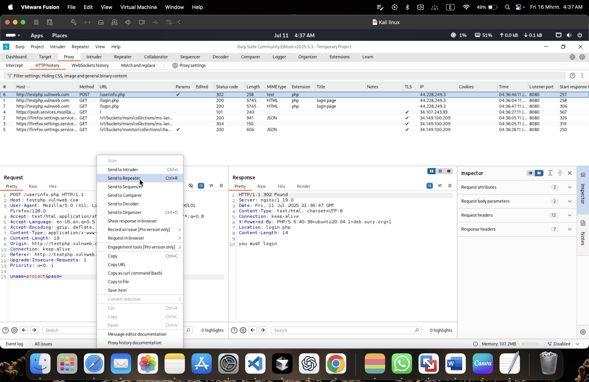
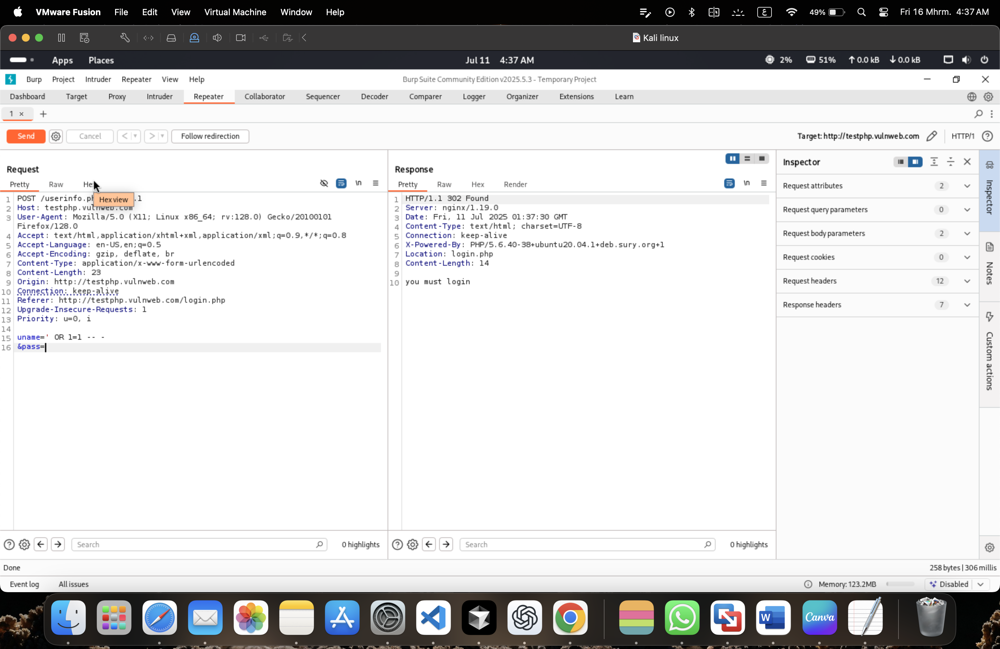
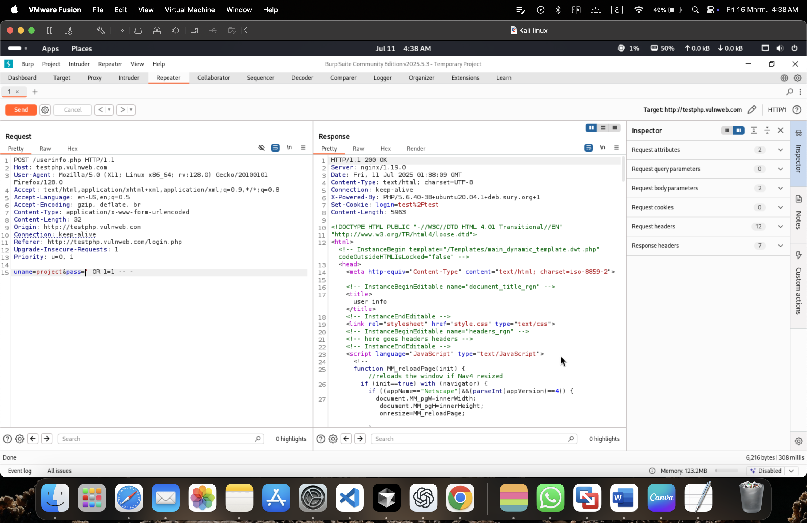

# 💉 Manual SQL Injection: Authentication Bypass

## 📄 Project Overview
This project demonstrates a manual **SQL Injection (SQLi)** attack on a login page to bypass authentication without knowing the password. The test was conducted on a vulnerable-by-design web application (`testphp.vulnweb.com`) using **Burp Suite Repeater**.

**Tools Used:**
*   **Burp Suite Community Edition** (Proxy & Repeater)
*   **Target:** VulnHub / TestPHP (Legal testing environment)
*   **Technique:** Tautology Attack (`' OR 1=1`)

---

## 🚀 Methodology (Step-by-Step)

### 1. Intercepting the Login Request
I started by capturing the standard login request using Burp Proxy to analyze how the application handles user input.
*   **Observation:** The server initially responded with a `302 Found` (redirect), indicating a failed login.


### 2. Injecting the Payload (Repeater)
I sent the request to **Repeater** and modified the `uname` (username) parameter. I injected a classic SQL payload to manipulate the backend query.

**Payload Used:**
```sql
' OR 1=1 -- -
```
*   **Explanation:** This payload forces the database query to always evaluate to `TRUE` (since 1 always equals 1), and the `-- -` comments out the rest of the query (like the password check).


### 3. Successful Bypass
After sending the modified request, the server responded with a **200 OK** status code and a significantly larger response size (**5963 bytes** vs 258 bytes). This confirmed that the application accepted the injection and logged me in as the administrator.


---

## 🛡️ Mitigation & Defense
To prevent SQL Injection vulnerabilities, developers must:
1.  **Use Prepared Statements (Parameterized Queries):** This is the most effective defense. It ensures the database treats user input as data, not executable code.
2.  **Input Validation & Sanitization:** Strictly validate all user inputs against a whitelist of allowed characters.
3.  **Principle of Least Privilege:** Ensure the database user used by the web app has only the minimum necessary permissions.

---
*Disclaimer: This project was conducted for educational purposes only on a specifically designed vulnerable application. Unauthorized testing is illegal.*
